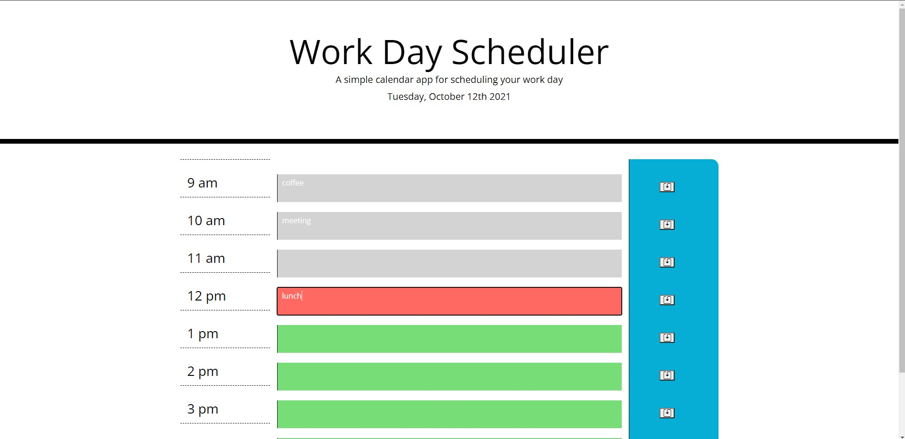

# Work Day Scheduler Starter Code

## Table of Contents
* [Description](#description)
* [Website](#website)
* [Screenshot](#screenshot)
* [Credit](#credit)
## Description

A website for scheduling your work day. This calendar offers 9 slots, one for each hour from 9 am to 5 pm. The current hour slot will be red. Past hours will be gray. Future hours will be green. Local storage allows users to input their schedule, leave the page, and return to re-check their scheudule.

## Website

View this page, hosted by Github:

https://hroddy.github.io/workday-scheduler/

## Screenshot

## Credit

Made by Hannah Roddy, 2021.
Github profile: [github.com/hroddy](github.com/hroddy)
Email: hannah.roddy@gmail.com